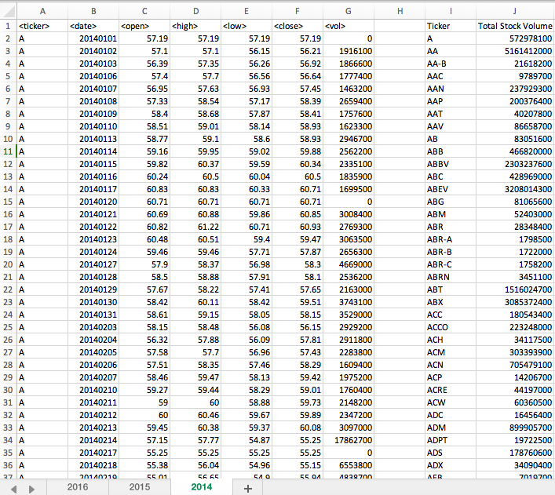
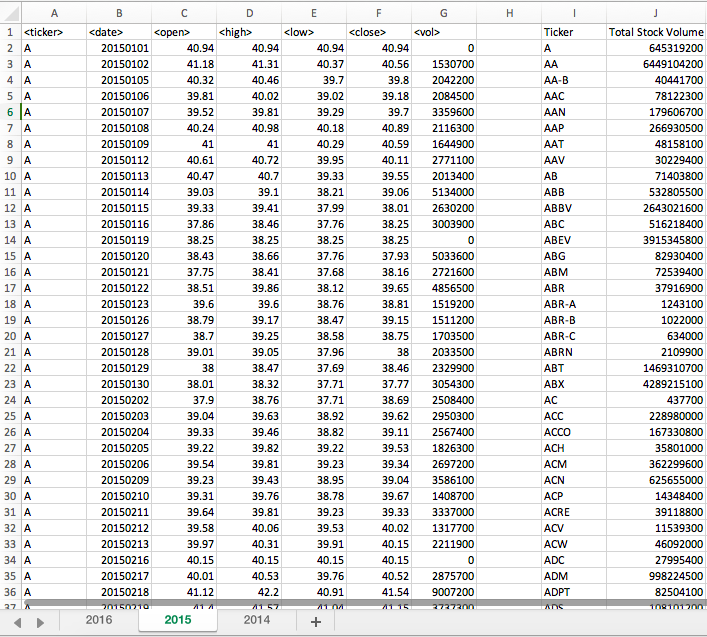
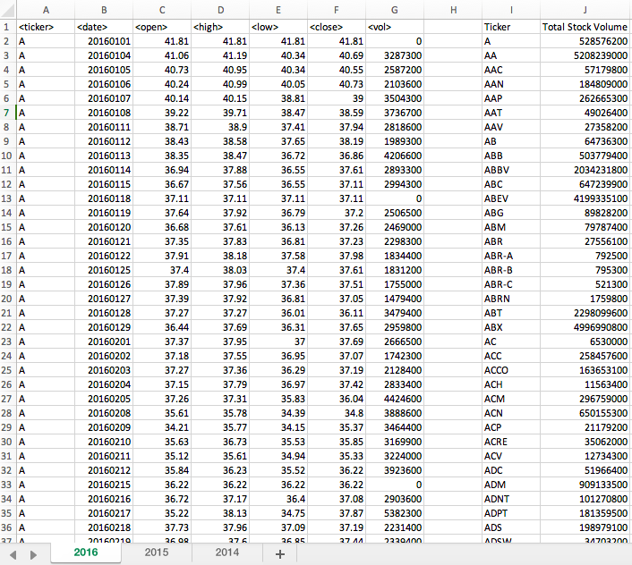

# Stock Market Data

Created a VBA script that loops through each year of stock data and calculates the total amount of volume that each stock had over the year.

* All the ticker symbols were displayed in a separate column with the stock volumes in a corresponding column. 

### Files: 
* [Stock Data](Multiple_year_stock_data.xlsm) - Stock data 2014-2016.

### Preview of Stock Data 2014:

### Preview of Stock Data 2015:

### Preview of Stock Data 2016:

